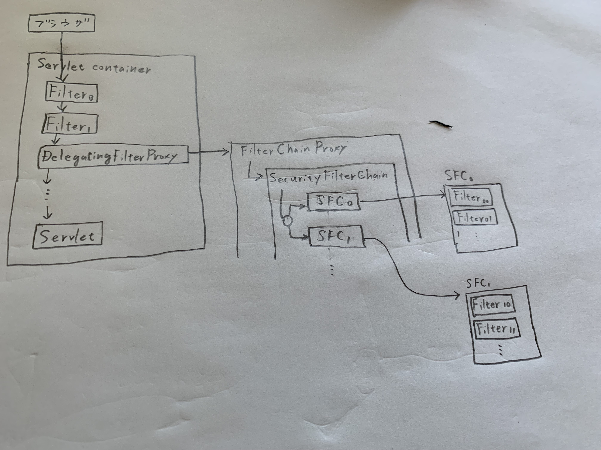

# Spring Security 勉強用のレポジトリ

## 基本

https://docs.spring.io/spring-security/reference/servlet/architecture.html

## Spring Security for Servlet application

### アーキテクチャ

Spring
Securityの外観を理解しておこう。参考にしたとキュメンとは[こちら](https://docs.spring.io/spring-security/reference/servlet/architecture.html)。

本題に入る前に、まずは、Servlet filterをおさらいすること。
なぜなら、Servletアプリケーション向けSpring Security機能は、Servlet
filterをベースにして実装されているため。 Servlet
filterは、Webアプリケーションのリクエスト処理の前処理や、レスポンス処理の後処理を実施するためのもの。ざっくりと理解するなら[こちら](https://www.javadrive.jp/servlet/filter/index1.html)
で十分。具体的に理解するなら[こちら](https://docs.oracle.com/cd/E18355_01/web.1013/B31859-01/filters.htm)。

さて。リクエストがサーバーに届いた後の処理フローを順に説明する。

#### リクエストはクライアントからFilterChainへ (Servletがリクエストを処理するメカニズム)

クライアントからのリクエストを最初に処理するのは、SpringBootではなくServlet containerだ。

[FilterChain](https://docs.oracle.com/javaee/7/api/javax/servlet/FilterChain.html)は
Servlet containerにより作られる。
このFilterChainがFilterの配列とServletを持つ。

リクエストは、FilterChainの中にあるFilterの配列の要素を順番に通ってゆく。やがてServletに到達する。
Servletがクライアントへレスポンスを返す。当然、いずれかのFilterでフィルタされてしまうこともある。

ここまでの処理は、Spring BootではなくServletが実行する。

#### FilterChain中のDelegatingFilterProxy -> FilterChainProxy (Servletがリクエストを処理するメカニズム)

処理をServletからSpringBootへ移譲するためのFilterが、DelegatingFilterProxyだ。
この辺りの詳細なフローは、ソースコードを読んでもようわからんかった。

#### FilterChainProxyの処理 (Spring Securityがリクエストを処理するメカニズム)

FilterChainProxyはSecurityFilterChainの配列を持つ。
SecurityFilterChainはFilterの配列を持つ（ここでやっと登場、Filterくん）。
フィルタリング処理の実態はFilterが担う。

FilterChainProxyは、リクエストパスなどを入力として、リクエストをどのSecurityFilterChainへ送るか判定する。
リクエストが送られるSecurityFilterChainは１つだけ。複数には送られない。

### 図にするとこんな感じか？

## Security Filter Chainの作り方を理解せよ

「アーキテクチャ」で述べた通り、SecurityFilterChainがフィルタ処理を担う。
要は、SecurityFilterChainの作り方を理解することができれば、Spring Securityをある程度使いこなせるようになる。

慣例では、Java ConfigによりSecurityFilterChainを作るっぽい。本サンプルコードでは、以下で作ってる。

[com.example.sbsecuritysandbox.SecurityConfiguration](./src/main/kotlin/com.example.sbsecuritysandbox/SecurityConfiguration.kt)